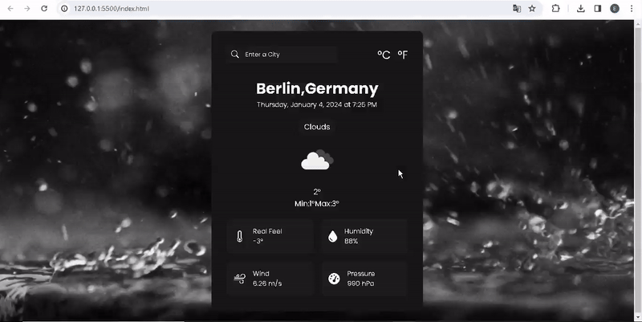

# 
<h1> Weather_app Website </h1>

I've independently designed and coded a responsive course website, and it's ready to explore!

🔸 Project Name: Weather_app Website

🔸 Technologies Used: HTML, CSS, JavaScript

🔸 Project Description: This website, which I designed and coded from scratch, works flawlessly on various devices, from mobile phones to desktop computers...

<h2>Screen_Shoot</h2>

